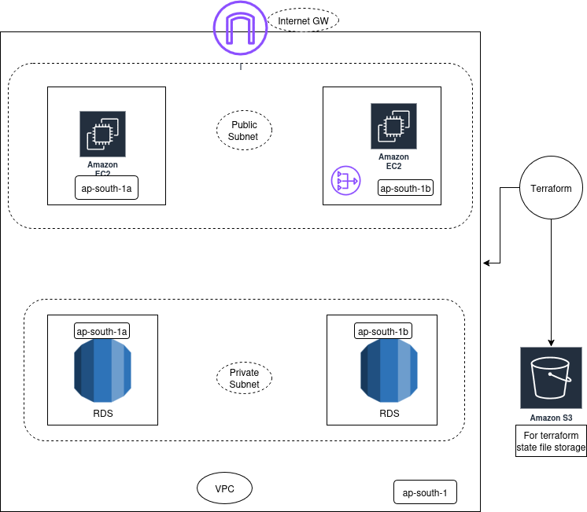

## Iac_project🚀

# This project provisions AWS infrastructure components using Terraform, including:
- Virtual Private Cloud (VPC) and networking
- EC2 instances
- Database resources
- Environment-specific configurations using variables, modules, and workspaces

Architecture -



## 📖 Table of Contents

# Infrastructure as Code (IaC) Project

[](https://terraform.io/)
[](https://aws.amazon.com/)

## 📋 Overview

This project provisions AWS infrastructure components using Terraform Infrastructure as Code (IaC) principles. It creates and manages cloud resources including VPC, EC2 instances, databases, and networking components with environment-specific configurations using Terraform variables, modules, and workspaces.

## 🏗️ Architecture

The infrastructure includes:

- **Virtual Private Cloud (VPC)** - Isolated network environment
- **EC2 Instances** - Virtual machines for application hosting
- **Database Resources** - Managed database services
- **Networking Components** - Subnets, route tables, internet gateways
- **Security Groups** - Firewall rules and access controls

## 📁 Project Structure

```
├── environments/
│   ├── dev/
│   ├── staging/
│   └── prod/
├── modules/
│   ├── vpc/
│   ├── frontwnd/
│   ├── database/
│   
├── variables.tf
├── main.tf
├── outputs.tf
├── asset
    └──Diagram.png
└── Readme.md
```

## 🚀 Quick Start

### Prerequisites

- [Terraform](https://terraform.io/downloads.html) >= 1.0
- [AWS CLI](https://aws.amazon.com/cli/) configured with appropriate credentials
- An AWS account with necessary permissions

### Installation & Setup

1. **Clone the repository**
   ```bash
   git clone https://github.com/joker295/Iac_project.git
   cd Iac_project
   ```

2. **Configure AWS credentials**
   ```bash
   aws configure
   ```
   Or set environment variables:
   ```bash
   export AWS_ACCESS_KEY_ID="your-access-key"
   export AWS_SECRET_ACCESS_KEY="your-secret-key"
   export AWS_DEFAULT_REGION="us-west-2"
   ```

3. **Initialize Terraform**
   ```bash
   terraform init
   ```

4. **Create terraform.tfvars file**
   ```bash
   cp terraform.tfvars.example terraform.tfvars
   ```
   Edit the values according to your requirements.

## 🛠️ Usage

### Working with Workspaces

Create and switch between different environments:

```bash
# Create a new workspace for development
terraform workspace new dev

# List available workspaces
terraform workspace list

# Switch to a specific workspace
terraform workspace select dev
```

### Deploy Infrastructure

1. **Plan the deployment**
   ```bash
   terraform plan -var-file="environments/dev/terraform.tfvars"
   ```

2. **Apply the configuration**
   ```bash
   terraform apply -var-file="environments/dev/terraform.tfvars"
   ```

3. **Destroy infrastructure (when needed)**
   ```bash
   terraform destroy -var-file="environments/dev/terraform.tfvars"
   ```

## ⚙️ Configuration

### Variables

Key variables that can be customized:

| Variable | Description | Default | Required |
|----------|-------------|---------|----------|
| `region` | AWS region for deployment | `us-west-2` | No |
| `environment` | Environment name (dev/staging/prod) | `dev` | Yes |
| `vpc_cidr` | CIDR block for VPC | `10.0.0.0/16` | No |
| `instance_type` | EC2 instance type | `t3.micro` | No |
| `key_pair_name` | AWS key pair for EC2 access | - | Yes |

### Example terraform.tfvars

```hcl
region          = "us-west-2"
environment     = "dev"
vpc_cidr        = "10.0.0.0/16"
instance_type   = "t3.micro"
key_pair_name   = "my-key-pair"
```

## 📦 Modules

### VPC Module
- Creates VPC with public and private subnets
- Configures internet gateway and NAT gateway
- Sets up route tables

### EC2 Module
- Provisions EC2 instances
- Configures security groups
- Sets up key pair authentication

### Database Module
- Creates RDS instances
- Configures subnet groups
- Sets up security groups for database access

## 🌍 Environments

The project supports multiple environments:

- **Development (dev)** - For development and testing
- **Staging (staging)** - For pre-production testing
- **Production (prod)** - For live applications

Each environment can have different configurations and resource sizes.

## 🔒 Security Considerations

- Use IAM roles and policies with least privilege principle
- Enable encryption for databases and storage
- Configure security groups with minimal required access
- Use private subnets for sensitive resources
- Regularly update and patch EC2 instances

## 🤝 Contributing

1. Fork the repository
2. Create a feature branch (`git checkout -b feature/amazing-feature`)
3. Commit your changes (`git commit -m 'Add some amazing feature'`)
4. Push to the branch (`git push origin feature/amazing-feature`)
5. Open a Pull Request

## 📝 Best Practices

- Always run `terraform plan` before `terraform apply`
- Use version pinning for Terraform and providers
- Store Terraform state remotely (S3 + DynamoDB)
- Use meaningful resource naming conventions
- Document your code with comments
- Use modules for reusable components

## 🐛 Troubleshooting

### Common Issues

**Issue**: `terraform init` fails
**Solution**: Check your AWS credentials and internet connectivity

**Issue**: Resource already exists error
**Solution**: Import existing resources or use different naming

**Issue**: Permission denied errors
**Solution**: Verify your AWS IAM permissions


## 📞 Support

For questions and support:
- Create an issue in this repository
- Check the [Terraform documentation](https://terraform.io/docs/)
- Review [AWS documentation](https://docs.aws.amazon.com/)

## 🔗 Useful Links

- [Terraform Best Practices](https://terraform.io/docs/cloud/guides/recommended-practices/)
- [AWS Well-Architected Framework](https://aws.amazon.com/architecture/well-architected/)
- [Terraform AWS Provider Documentation](https://registry.terraform.io/providers/hashicorp/aws/latest/docs)

---

**⭐ Star this repository if you find it helpful!**